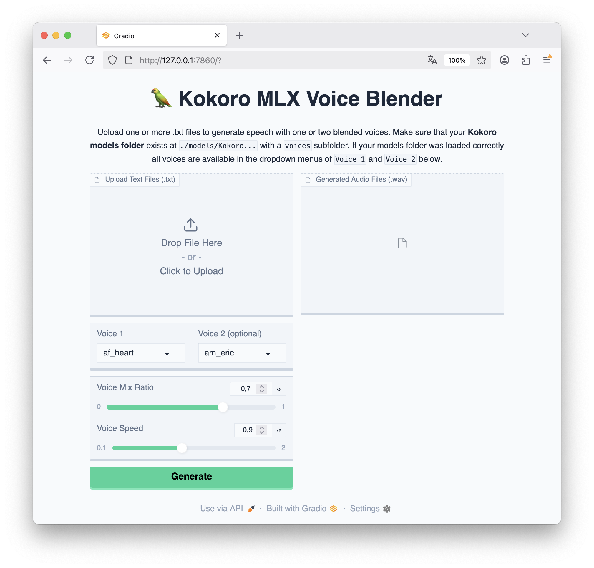

[](https://badge.fury.io/py/kb-mlx)

# 🦜 Voice Blender CLI for Kokoro MLX

Run **Text-To-Speech** with the [MLX implementation](https://huggingface.co/models?search=mlx%20kokoro) (Mac M1-M4) of [Kokoro](https://github.com/hexgrad/kokoro) to vastly improve processing speed. Use one voice or blend two voices by specifying a mixing ratio. 

The app comes with a user-friendly [gradio web interface](#gradio-app).

## Table of Contents
* [Prerequisites](#prerequisites)
* [Installation](#installation)
* [Usage](#usage)
* [Examples](#examples)
* [Gradio Web App](#gradio-app)
* [Acknowledgment](#acknowledgment)

## Prerequisites

* Python >= 3.10
* HuggingFace Access Token

## Installation

### 1. Clone this repo
```shell
git clone https://github.com/tsmdt/kokoro-MLX-blender.git
```

### 2. Change to project folder
```shell
cd kokoro-MLX-blender
```

### 3. Create a python env and activate it
```shell
python3 -m venv venv_kokoro
source venv_kokoro/bin/activate
```

### 4. Install kokoro-MLX-blender
```shell
pip install .
```

### 5. Download Kokoro MLX model using huggingface-cli
Run the following command from the main project folder (`./kokoro-MLX-blender/`)

```shell
huggingface-cli download --local-dir models/Kokoro-82M-bf16 mlx-community/Kokoro-82M-bf16
```
Ensure that the folder `Kokoro-82M-bf16` ([Hugging Face](https://huggingface.co/mlx-community/Kokoro-82M-bf16/)) with a `voices` subfolder and various `.pt` files (e.g. `af_heart`, `af_alloy`, etc.) now exists within the `models` folder. Your directory should look like this:

```markdown
kokoro-MLX-blender
├── kb_mlx/
├── models/
│   └── Kokoro-82M-bf16/
│       ├── samples/
│       ├── voices/
│       ├── .gitattributes
│       ├── config.json
│       ├── DONATE.md
│       ├── kokoro-v1_0.safetensors
│       ├── README.md
│       ├── SAMPLES.md
│       └── VOICES.md
├── .gitignore
├── LICENSE
├── README.md
...
```
> [!Note]
You can use different versions of the KokoroMLX model as well. Download your preferred one from [HuggingFace](https://huggingface.co/models?search=mlx%20kokoro) (cf. [Installation step 5](#5-download-mlx-kokoro-model-using-huggingface-cli)) and make sure that the downloaded Kokoro model folder exists within the `models` folder of `kokoro-MLX-blender`. 

### 6. Check if everything works correctly
Run the following command in CLI to check if everything works.

```shell
kbx list
```

If you see a list of voice names `kokoro-MLX-blender` should work. If not please make sure that you downloaded the `kokoro` model in the previous step and placed it correctly in your `models` folder.

## Usage
```shell
$ kbx run

 Usage: kbx run [OPTIONS]

 Run TTS with KokoroMLX for M1-M4. Use one voice or blend two voices.

╭─ Options ────────────────────────────────────────────────────────────────────────────────────────────────────────────────────────────╮
│ *  --text        -t                   TEXT       Input text(s) as string, single .txt or directory path [default: None] [required]   │
│    --voice1      -v1                  TEXT       Name of the first voice (without .pt) [default: af_heart]                           │
│    --voice2      -v2                  TEXT       Name of second voice (without .pt); if omitted, use only voice1 [default: None]     │
│    --mix-ratio   -m                   FLOAT      Blend weight for voice1 and voice2 (0.5 = 50% each) [default: 0.5]                  │
│    --speed       -s                   FLOAT      Speed multiplier (1.5 = 50% faster, 0.5 = 50% slower) [default: 1]                  │
│    --model-dir   -md                  DIRECTORY  Path to the local Kokoro model directory [default: ./models/Kokoro-82M-bf16]        │
│    --output-dir  -o                   TEXT       Directory where output audio file will be saved [default: ./output]                 │
│    --verbose          --no-verbose               Enable verbose output [default: verbose]                                            │
│    --help                                        Show this message and exit.                                                         │
╰──────────────────────────────────────────────────────────────────────────────────────────────────────────────────────────────────────╯
```

## Examples

Run TTS with two blended voices (60% voice1 and 40% voice2)
```shell
kbx run -t "This is a test in blending the male American voice of Eric with the female American voice of Heart." -v1 am_eric -v2 af_heart -m 0.6
```

## Gradio App

Launch the Gradio web app like this:
```shell
kbx app
```



## Acknowledgment

OpenAI's `o4-mini-high` was used for creating the CLI app.

## Citation

```bibtex
@software{kokoro_mlx_blender,
  author       = {Thomas Schmidt},
  title        = {Voice Blender CLI for Kokoro MLX},
  year         = {2025},
  url          = {https://github.com/tsmdt/kokoro-MLX-blender},
  note         = {Accessed: 2025-05-29}
}
```
